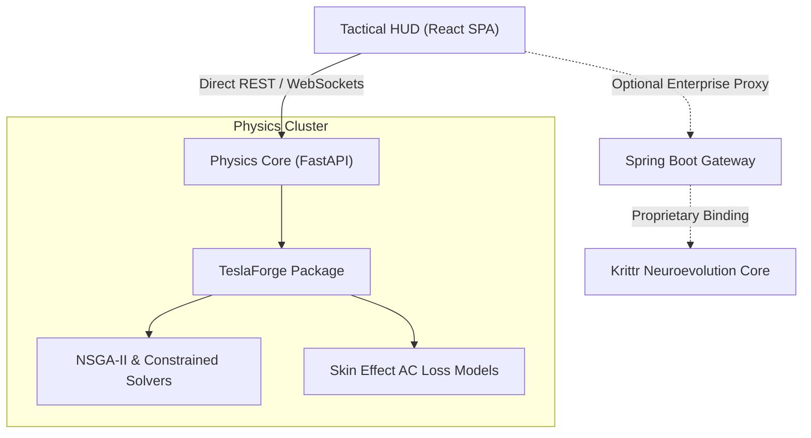

<div align="center">
  
  
  
  
  
  <h1>⚡ Tesla Coil Optimizer (TCO)</h1>
  <p><strong>Beyond Physics. Beyond Limits.</strong></p>
  <p><i>The most powerful, mathematically rigorous open-source resonant transformer design solver and telemetry HUD ever engineered.</i></p>

  [](./LICENSE)
  []()
  []()
  []()
</div>

---

## 🌌 Overview

The **Tesla Coil Optimizer (TCO)** bridges the gap between traditional analytical high-voltage physics and bleeding-edge numerical simulation. It is designed to evaluate, optimize, and simulate the behavior of high-voltage resonant transformers—ranging from benchtop hobbyist spark gap coils up to theoretical **Megawatt-class phased arrays** designed for city-scale wireless power delivery.

By leveraging multi-objective genetic algorithms (NSGA-II) and continuous local trust-region solvers, TCO pushes resonant electrical design into uncharted territory.

---

> [!WARNING]  
> **OPEN SOURCE VS. PROPRIETARY BOUNDARIES**
> 
> Dexmond Technologies is proud to release the **Tactical HUD Frontend**, the **FastAPI REST Service**, and the core **TeslaForge Physics Engine** as open-source software under the MIT License to support the high-voltage engineering community. 
> 
> Please note that the advanced neuroevolution AI gateway (**Krittr**) is a proprietary enterprise module. The open-source TCO operates fully locally via standard global and local mathematical minimizers. To integrate commercial Krittr libraries, refer to the Enterprise Profile guidelines.

---

## 🏗️ Monorepo Architecture

TCO uses a decoupled microservice pattern that separates heavy-duty numerical computing from visual real-time telemetry.



### Key Modules:
*   **[TeslaForge](./core/TeslaForge/)**: The core python library containing pure physical closed-form models (Wheeler's helical/flat spirals, Medhurst self-capacitance, Neumann elliptic mutual inductances) and Optuna-based solvers.
*   **[apps/frontend/](./apps/frontend/)**: A beautiful, hardware-accelerated React/Vite interface featuring a cyber-industrial HUD, **interactive 3D WebGL parametric coil rendering (React Three Fiber)**, resonance needle gauges, and **Real-Time WebSockets telemetry for live genetic algorithm plotting (Chart.js)**.
*   **[apps/backend-python/](./apps/backend-python/)**: Lightweight FastAPI wrapper exposing the physics optimization core to external REST clients, **now upgraded with async WebSockets for real-time telemetry streaming.**
*   **[scripts/fetch_references.sh](./scripts/fetch_references.sh)**: On-demand setup utility that synchronizes community open-source references (calculators, interrupters, MIDI players) in one place.

---

## ⚙️ Fast Local Installation

To spin up the local environment, ensure you have **Docker** and **Docker Compose** installed.

### 1. Synchronize Reference Repositories
Download community schematics, firmware, and MIDI tools into a local ignored folder:
```bash
./scripts/fetch_references.sh
```

### 2. Launch the Microservices Stack
```bash
cd apps
# Boot the standard React HUD & Python FastAPI Physics Core
docker compose up -d --build
```
Vite HUD is now active at `http://localhost:5173`. The FastAPI engine runs at `http://localhost:8000`.

### 3. (Optional) Launch with Enterprise Krittr Profile
```bash
cd apps
# Launches HUD, Python core, and Spring Boot enterprise gateway
docker compose --profile enterprise up -d --build
```

---

## 🔌 Mathematical Core & Physics Upgrades

TCO incorporates premium electromagnetic modeling formulas to predict physical behavior before you cut copper:

### 1. Neumann Mutual Inductance via Elliptic Integrals
Calculates coupling coefficients ($k$) by summing filamentary turn combinations over elliptic integrals:
```python
# From teslaforge.core.physics
k2 = (4.0 * R * r) / ((R + r)**2 + dz**2)
M_pairs = MU_0 * np.sqrt(R * r) * ((2.0/k - k) * K - (2.0/k) * E)
```

### 2. Frequency-Dependent AC Resistance
Avoids idealized DC approximations. Incorporates conductor skin-depth losses based on operational frequency:
$$\delta = \sqrt{\frac{\rho}{\pi f \mu}} \quad \implies \quad R_{ac} \approx R_{dc} \cdot \frac{d_{wire}}{4\delta}$$
This guarantees highly accurate real-world secondary copper loss predictions under high-frequency operation.

---

## 🤝 Contributing

We welcome contributions from high-voltage makers, developers, and physics researchers. Please review [CONTRIBUTING.md](./CONTRIBUTING.md) to understand local environment setup, style formatting (`black`, `flake8`), and test suites (`pytest`).

To run unit tests locally:
```bash
cd core/TeslaForge
pytest tests/
```

---

> [!CAUTION]
> **LETHAL VOLTAGES ARE PRESENT IN HIGH-VOLTAGE SYSTEMS.**
> The values and geometries generated by this software are theoretical estimates based on idealized mathematical approximations. Dexmond Technologies is not liable for structural failures, dielectric breakdown, flashovers, thermal runaways, or physical injuries. Always consult a licensed electrical engineer and implement certified safety isolation protocols before handling operational hardware.

---
*Developed by the Advanced Projects Division at [Dexmond Technologies](https://dexmond.com)*
