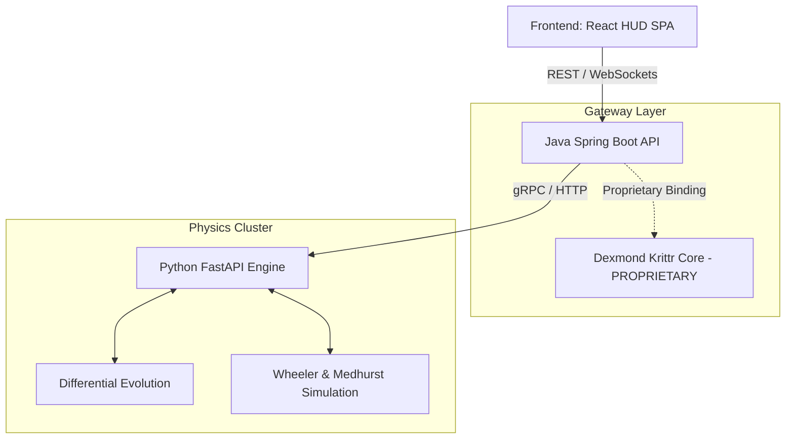

<div align="center">
  
  
  
  
  
  <h1>⚡ Tesla Coil Optimizer (TCO)</h1>
  <p><strong>Beyond Physics. Beyond Limits.</strong></p>
  <p><i>Engineered by Dexmond Technologies for city-scale power delivery and high-efficiency resonant transformer design.</i></p>

  [](https://opensource.org/licenses/MIT)
  []()
  []()
</div>

---

## 🌌 Overview

The **Tesla Coil Optimizer (TCO)** bridges the gap between traditional analytical physics and bleeding-edge numerical simulation. It is designed to evaluate, optimize, and simulate the behavior of high-voltage resonant transformers—ranging from hobbyist benchtop coils up to theoretical **Megawatt-class phased arrays** designed for city-scale wireless power delivery.

By leveraging differential evolution and advanced Finite-Difference Time-Domain (FDTD) approximations, TCO pushes resonant design into uncharted territory.

---

> [!WARNING]  
> **OPEN SOURCE VS. PROPRIETARY COMPONENTS**
> 
> Dexmond Technologies is proud to release the **Frontend UI** and **Python Physics Engine** as open-source software under the MIT License to support the high-voltage engineering community. 
> 
> However, please note that **Krittr** (our advanced Java neuroevolution and dynamic topology AI engine) is proprietary intellectual property of Dexmond Technologies. The core Krittr libraries and proprietary enterprise APIs are **NOT included** in this open-source release. The provided Java integration layer acts as a stub/proxy, allowing you to run the physics and evolutionary algorithms locally via Python, but the true enterprise Krittr brain remains securely behind Dexmond's private infrastructure.

---

## 🚀 Key Features

*   **FRONTIER MODE**: Unlock simulation parameters for massive-scale architectures, including superconducting NbTi arrays, cryogenic LN2 cooling, and kilometer-range radiative resistance models.
*   **Differential Evolution Tuning**: Evaluates millions of geometric permutations using `scipy.optimize.differential_evolution` to lock onto the precise resonance targets.
*   **Zero-Compromise Safety Profiling**: Dynamically maps peak voltage stresses, dielectric breakdown limits, and ozone generation hazards.
*   **Cyber-Industrial HUD**: A beautifully dense, hardware-accelerated React/Vite interface featuring live telemetry, arc visualization, and responsive tuning states.

## 🏗️ Architecture

The architecture relies on a decoupled microservice pattern to separate the frontend telemetry, the Java API gateway, and the heavy-duty numerical computing happening in Python.



## ⚙️ Installation & Usage

To spin up the local environment, ensure you have **Docker** and **Docker Compose** installed.

1.  **Clone the repository**:
    ```bash
    git clone https://github.com/dexmond/teslacoil-optimizer.git
    cd teslacoil-optimizer
    ```

2.  **Deploy the backend services**:
    ```bash
    cd app
    docker-compose up -d --scale python-engine=2
    ```
    *(Scaling the Python engine allows the Java gateway to distribute evolutionary population calculations in parallel).*

3.  **Start the Frontend**:
    ```bash
    cd app/frontend
    npm install
    npm run dev
    ```

Navigate to `http://localhost:5173` to access the TCO Tactical HUD.

## 🔌 API Documentation

The Java API gateway proxies requests to the Python engine. You can submit raw JSON payloads to trigger the optimizer programmatically.

**POST `/api/v1/krittr/evolve`**
```json
{
  "primary_coil": { "turns": 6, "wire_gauge_awg": 4, "diameter_mm": 150, "height_mm": 50, "geometry": "Flat_Spiral", "material": "NbTi_Superconductor", "cooling_system": "LN2_Cryo" },
  "secondary_coil": { "turns": 900, "wire_gauge_awg": -10, "diameter_mm": 100, "height_mm": 500, "geometry": "Helical", "material": "NbTi_Superconductor", "cooling_system": "LN2_Cryo" },
  "top_load": { "major_diameter_mm": 300, "minor_diameter_mm": 100 },
  "primary_capacitor": { "capacitance_nf": 20, "voltage_rating_kv": 30 },
  "power_source": { "voltage_v": 10000, "frequency_hz": 60, "type": "MW_Grid_Tap" },
  "infrastructure": { "target_distance_km": 5.0, "phased_array_nodes": 4, "sync_ms": 1.25 },
  "frontier_mode": true
}
```

## 🌆 City-Scale Production Guide

To transition from benchmarking to **city-scale Megawatt production**, the TCO must be operated entirely differently than a standard physics simulator. Follow this sequence to map a municipal resonant grid:

1. **Activate Frontier Mode (`"frontier_mode": true`)**
   Standard physics simulation applies aggressive safety derating to prevent thermal runaway. Engaging Frontier Mode unlocks the FDTD (Finite-Difference Time-Domain) approximations and differential evolution paths required for far-field radiative coupling. 
2. **Deploy Phased Array Geometry (`"phased_array_nodes": 4+`)**
   A single tower cannot power a city without ionizing the local atmosphere. You must simulate an array. By increasing `phased_array_nodes` and defining a `target_distance_km` (e.g., 5.0 km radius), the Krittr engine will optimize for *constructive wave interference*, bouncing resonant waves off the ionosphere or ground channels to create power "hotspots" exactly where needed.
3. **Phase Synchronization (`"sync_ms": X.X`)**
   For multiple nodes to deliver power without destructive interference, they must pulse in exact kilohertz lockstep. Allow the Krittr optimizer to run up to 200 generations to find the perfect `sync_ms` offset for your geographical layout.
4. **Enforce Superconducting Materials**
   At Megawatt scales, copper secondary coils will instantly vaporize due to I²R heating. You must set both the primary and secondary `"material"` to `"NbTi_Superconductor"` and ensure the `"cooling_system"` is set to `"LN2_Cryo"`. The engine will mathematically model a zero-resistance thermal state, ensuring the system calculates maximum possible transfer efficiency without thermal throttling.

## 🤝 Strategic Partnerships & Enterprise Escalation

To bring the Megawatt-class **Frontier Mode** from numerical simulation into physical reality, Dexmond Technologies requires the direct intervention and infrastructural support of our core enterprise partners. We have identified the following critical escalation paths:

### 🔷 IBM (Enterprise Cloud & Compliance)
While the open-source algorithms run locally, scaling the Krittr topology to handle real-time, city-wide phased array synchronization requires massive compute. We require IBM's intervention for:
1. **Z-Series Mainframe Integration**: Porting the proprietary Krittr Java engine to run natively on IBM zSystems for zero-latency, highly secure evolutionary processing.
2. **Audit & Compliance**: Finalizing the global rollout of the TCO web platform to ensure it meets strict IBM Equal Access Accessibility standards and enterprise-grade Content Security Policies (CSP).
3. **Quantum-Safe Encryption**: Securing the telemetry between the energy nodes and the Krittr orchestrator against intrusion.

### ⚡ Tesla (Hardware Manufacturing & Grid Deployment)
The physics engine can perfectly calculate the geometry for a 50-meter superconducting resonant transformer, but manufacturing it is an industrial challenge. We require Tesla's intervention for:
1. **Gigafactory Production**: Utilizing Tesla's advanced manufacturing capabilities to construct the massive NbTi (Niobium-Titanium) secondary coils and cryogenic LN2 cooling jackets.
2. **High-Voltage Component Sourcing**: Providing the commercial-grade IGBT/MOSFET driver banks capable of handling MW-class continuous loads without thermal runaway.
3. **Grid Interconnects**: Integrating the TCO's phased array outputs directly with Megapack battery stations and existing municipal energy grids to act as the primary power source for the resonant network.

---

> [!CAUTION]
> **LETHAL VOLTAGES ARE PRESENT IN TESLA COILS.**
> The outputs generated by this software are theoretical estimates based on idealized numerical models. Dexmond Technologies is not liable for structural failures, thermal runaways, dielectric breakdowns, or any physical harm resulting from the construction of high-voltage systems based on these parameters. **Always employ standard safety isolation procedures and consult a certified electrical engineer before interacting with resonant power systems.**

---
*Developed by the Advanced Projects Division at [Dexmond Technologies](https://dexmond.com)*
